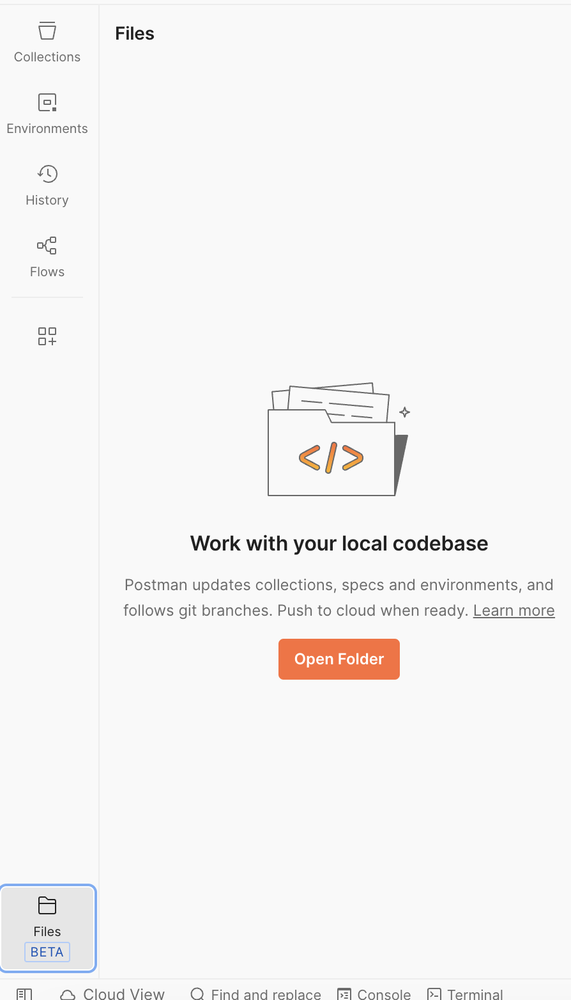
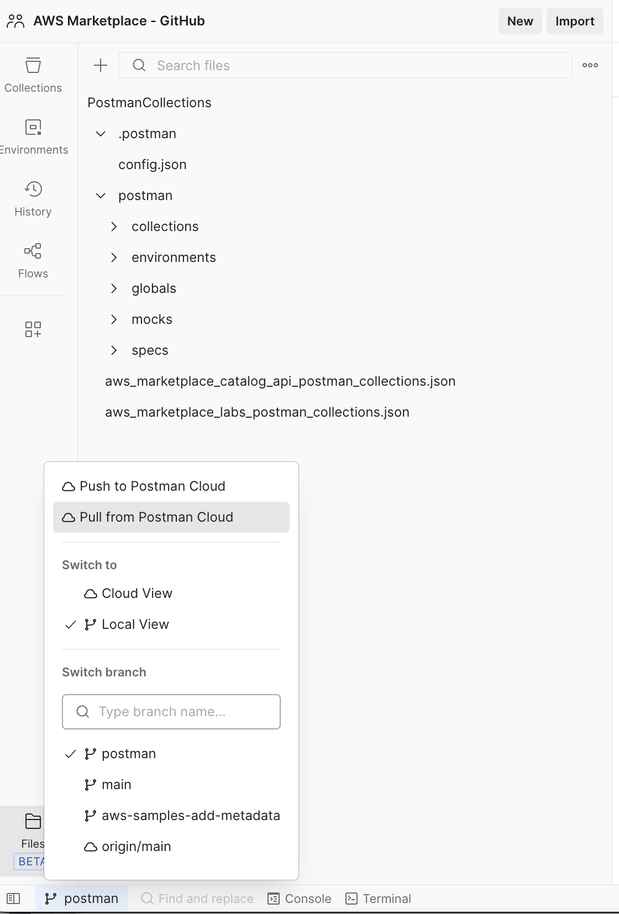
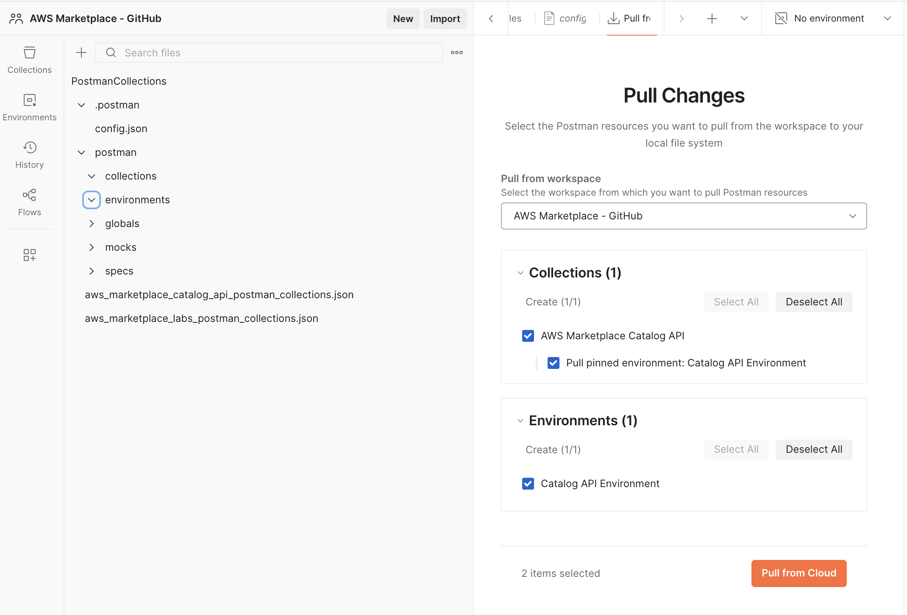
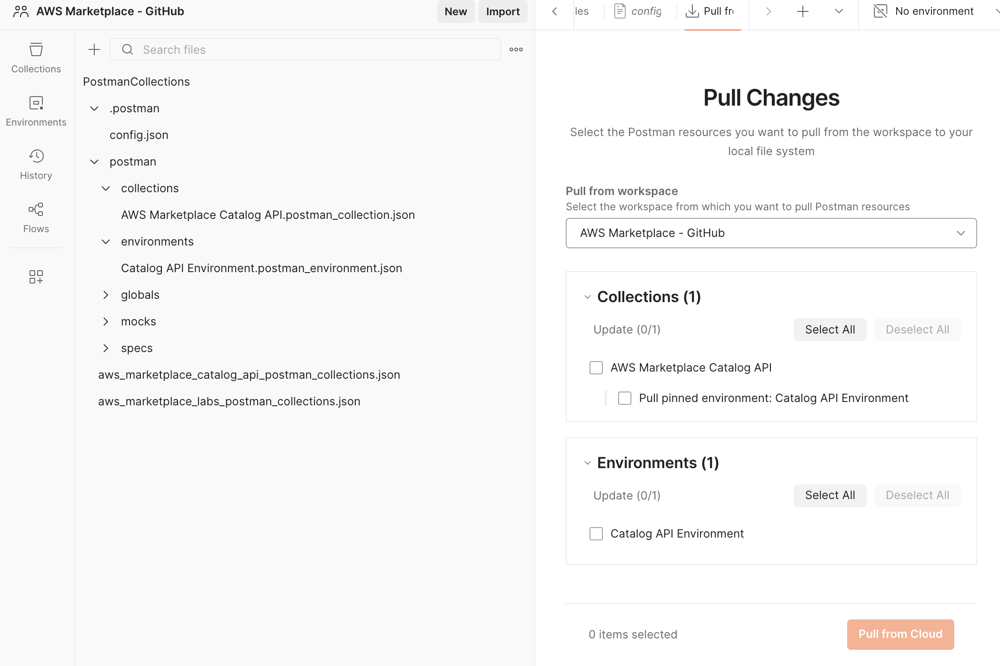
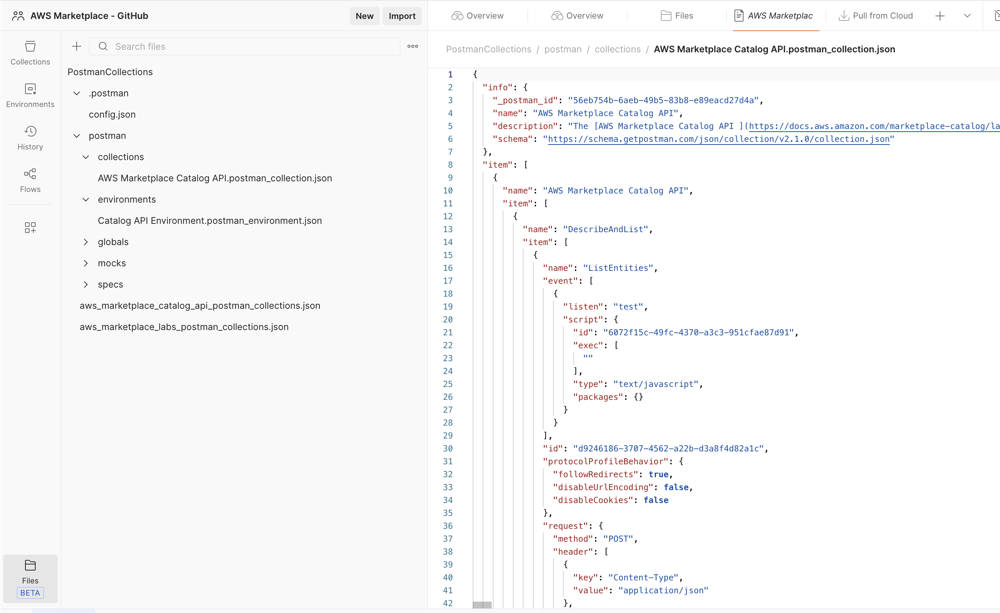
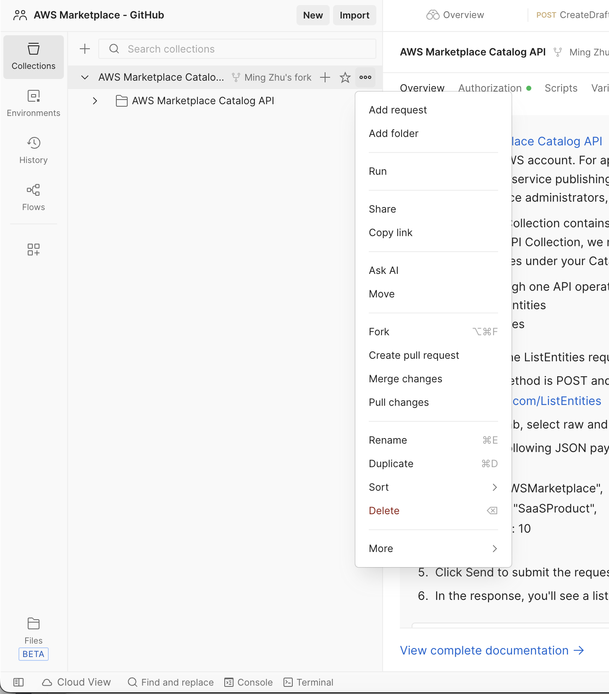
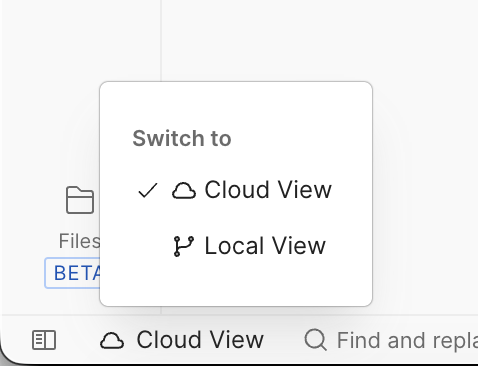
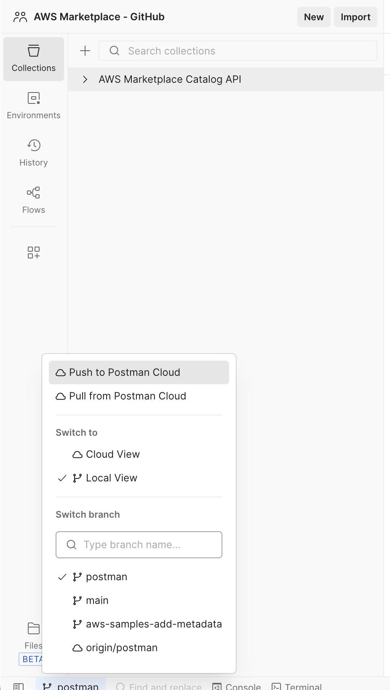

# AWS Marketplace API Release Guide

This guide outlines the complete workflow for releasing a new set of AWS Marketplace APIs, from initial engineering handoff to publishing the Postman collection in the GitHub repository.

## Overview

The API release process involves four main phases:
1. Engineering provides Insomnia collection from Smithy model
2. SA tests and creates use case-based action chains
3. SA imports to Postman and adds documentation
4. SA connects Postman to GitHub and creates pull request

## Prerequisites

- [Insomnia](https://insomnia.rest/) installed
- [Postman Desktop App](https://www.postman.com/downloads/) installed
- Git installed and configured
- Access to AWS Marketplace API endpoints (beta, gamma, prod)
- AWS credentials configured
- GitHub repository access

## Smithy Model Reference

The AWS Marketplace Catalog API is defined in the Smithy model:
- **GitHub Repository**: https://github.com/aws/api-models-aws/blob/main/models/marketplace-catalog/service/2018-09-17/marketplace-catalog-2018-09-17.json

**Important**: When this Smithy model file is updated, SA should be notified to coordinate with Engineering on any required updates to the Postman collection.

---

## Phase 1: Engineering Handoff

### 1.1 Receive Insomnia Collection

Engineering generates an Insomnia collection from the Smithy model containing basic API actions.

**What to expect:**
- Collection file (JSON format) with all API endpoints
- Basic request structures for each API action
- Authentication configuration (AWS Signature v4)
- Endpoint configurations for different environments:
  - **Beta**: `https://catalog.marketplace.beta.us-east-1.amazonaws.com`
  - **Gamma**: `https://catalog.marketplace.gamma.us-east-1.amazonaws.com`
  - **Prod**: `https://catalog.marketplace.us-east-1.amazonaws.com`

### 1.2 Import Insomnia Collection

```bash
# Open Insomnia and import the collection
# File > Import > From File > Select the JSON collection file
```

### 1.3 Verify Collection Structure

Ensure the collection includes:
- [ ] All API endpoints defined in the Smithy model
- [ ] Correct HTTP methods (GET, POST, PUT, DELETE)
- [ ] Request headers (Content-Type, Accept)
- [ ] AWS authentication setup
- [ ] Environment variables for endpoints:
  - `CAPI_BETA` - Beta endpoint
  - `CAPI_GAMMA` - Gamma endpoint  
  - `CAPI_PROD` - Production endpoint

---

## Phase 2: SA Testing

### 2.1 Test Basic API Actions

Test each API action individually across environments (beta → gamma → prod):

1. **Configure Environment Variables**
   - Set AWS region
   - Set API endpoint URL (start with beta, then gamma, then prod)
   - Configure authentication credentials

2. **Execute Each Request**
   - Verify successful responses (2xx status codes)
   - Document any errors or issues
   - Note required parameters and their formats

### 2.2 Create Use Case-Based Action Chains

Design and test realistic workflows that chain multiple API calls:

**Example Workflow: Create and Manage Product**
1. CreateProduct → Get ProductId
2. DescribeProduct → Verify creation
3. UpdateProduct → Modify attributes
4. ListProducts → Verify in list

### 2.3 Document Test Results

For each use case:
- Document the sequence of API calls
- Note dependencies between calls (e.g., ProductId from step 1 used in step 2)
- Record sample request/response payloads
- Identify variables that need to be passed between requests

---

## Phase 3: Postman Import and Documentation

### 3.1 Export from Insomnia

```bash
# In Insomnia:
# 1. Right-click on the collection
# 2. Select "Export"
# 3. Choose "Insomnia v4 (JSON)" format
# 4. Save the file
```

### 3.2 Import to Postman

**Best Practice**: Import into a private or team workspace first before publishing to the shared workspace.

1. Open Postman Desktop App
2. Create or select a **private/team workspace** for initial import
3. Click "Import" button
4. Select the exported Insomnia JSON file
5. Review and confirm import
6. Test and validate before moving to shared workspace

### 3.3 Organize Collection Structure

Structure the collection logically:
```
AWS Marketplace [API Name]
├── DescribeAndList
│   ├── ListEntities
│   └── DescribeEntity
├── Product
│   ├── Container Product
│   │   ├── CreateDraftContainerProductWithDraftPublicOffer
│   │   └── CreateLimitedContainerProductPublicOffer
│   ├── SaaS Product
│   │   └── ...
│   └── AMI Product
│       └── ...
├── Offer
│   ├── CreateOffer
│   ├── UpdateOffer
│   └── ...
└── Use Cases
    ├── Create Product with Public Offer
    └── ...
```

### 3.4 Add Documentation

For each request, add description including purpose, prerequisites, and related API calls.

### 3.5 Configure and Enhance Collection

Complete the following enhancements for each request:

1. **Configure Variables** - Set up collection and environment variables for endpoints, IDs, and other reusable values. For AWS credentials, use Postman Vault for secure credential management.

2. **Add Pre-request Scripts** - Set up dynamic variables needed in request payloads (e.g., UUIDs, timestamps, random fields).

3. **Add Post-response Scripts** - Add response validation tests and extract variables for use in subsequent requests.

4. **Add Sample Request Payloads** - Include request body with variables for each API action.

5. **Add Sample Response Payloads** - Document expected successful and error responses.

---

## Phase 4: GitHub Integration

### 4.1 Connect Postman to Local Git Repository

Reference: [Postman Native Git Integration](https://learning.postman.com/docs/agent-mode/native-git)

1. **Open Local Folder in Postman**
   - Click the **Files** icon in the left sidebar
   - Click **Open Folder**
   - Navigate to your local git repository
   - Select the folder where you want to store the Postman collection (e.g., `PostmanCollections/postman`)



### 4.2 Pull from Postman Cloud

Before making changes, pull the latest from Postman cloud to ensure you have the most recent version.



Click "Pull changes" to sync your local Postman with the cloud workspace.



### 4.3 Review Pulled Changes

After pulling, verify the changes are reflected in your local Postman.





### 4.4 Create Feature Branch

```bash
# Navigate to repository
cd /path/to/aws-marketplace-reference-code

# Ensure you're on main and up to date
git checkout main
git pull origin main

# Create and checkout new feature branch
git checkout -b feature/new-api-collection
```

### 4.5 Pull Changes to Local Repository

In Postman, use the Git integration to pull changes to your local file system:

1. Go to Source Control panel
2. Click "Pull" to sync Postman collection to local files
3. Verify files are updated in `PostmanCollections/postman/`

### 4.6 Merge Changes to Published Workspace

If working with a team, merge your changes to the published workspace.



### 4.7 Verify Changes

Compare the Postman cloud view with your local view to ensure consistency.

**Postman Cloud View:**


**Postman Local View:**


### 4.8 Stage and Commit Changes

```bash
# Check status
git status

# Stage all Postman collection changes
git add PostmanCollections/

# Commit with descriptive message
git commit -m "Add [API Name] Postman collection

- Add API endpoints for [feature]
- Include pre-request scripts for dynamic variables
- Add post-response tests for validation
- Document all requests with descriptions
- Add sample request/response payloads"
```

### 4.9 Push to Remote

```bash
# Push feature branch to remote
git push origin feature/new-api-collection
```

### 4.10 Create Pull Request

1. Go to GitHub repository: https://github.com/aws-samples/aws-marketplace-reference-code
2. Click "Compare & pull request" for your branch
3. Fill in PR details:
   - Title: `Add [API Name] Postman Collection`
   - Description: Include summary of changes, testing done, and any notes for reviewers
4. Request reviewers
5. Submit pull request

### 4.11 Address Review Feedback

```bash
# Make changes based on feedback
# ... edit files ...

# Stage and commit changes
git add .
git commit -m "Address PR feedback: [description]"

# Push updates
git push origin feature/new-api-collection
```

### 4.12 Merge and Cleanup

After PR approval:

```bash
# After PR is merged on GitHub, update local main
git checkout main
git pull origin main

# Delete local feature branch
git branch -d feature/new-api-collection

# Delete remote feature branch (if not auto-deleted)
git push origin --delete feature/new-api-collection
```

---

## Monitoring for API Updates

### Smithy Model Change Notifications

Set up monitoring for changes to the Smithy model to stay informed of API updates:

**GitHub Watch:**
1. Go to https://github.com/aws/api-models-aws
2. Click "Watch" > "Custom" > Select "Releases" and "Discussions"
3. You'll receive notifications when the model is updated

**Manual Check:**
Periodically check the Smithy model file for changes:
- https://github.com/aws/api-models-aws/blob/main/models/marketplace-catalog/service/2018-09-17/marketplace-catalog-2018-09-17.json

When changes are detected:
1. Coordinate with Engineering to understand the scope of changes
2. Update the Insomnia/Postman collection accordingly
3. Follow this guide to test and publish updates

---

## Checklist

### Pre-Release
- [ ] Received Insomnia collection from Engineering
- [ ] Verified endpoints for beta, gamma, and prod environments
- [ ] All basic API actions tested successfully across environments
- [ ] Use case workflows created and tested
- [ ] Edge cases and error scenarios documented

### Postman Setup
- [ ] Collection imported to private/team workspace first
- [ ] Folder structure organized logically
- [ ] All requests have descriptions
- [ ] Variables configured (collection and environment)
- [ ] AWS credentials stored in Postman Vault (not in environment)
- [ ] Pre-request scripts added for dynamic variables (UUID, timestamps)
- [ ] Post-response scripts added for validation and variable extraction
- [ ] Sample payloads documented with real examples

### GitHub Integration
- [ ] Feature branch created
- [ ] Postman connected to local Git repository folder
- [ ] Changes committed with descriptive message
- [ ] Pull request created
- [ ] PR reviewed and approved
- [ ] Changes merged to main
- [ ] Local branches cleaned up

### Post-Release
- [ ] Set up monitoring for Smithy model changes
- [ ] Document any known issues or limitations
- [ ] Share collection link with team

---

## Troubleshooting

### Common Issues

**Authentication Errors:**
- Verify AWS credentials are correctly stored in Postman Vault
- Check that credentials have required permissions
- Ensure region is correctly configured

**Git Sync Issues:**
```bash
# If local changes conflict with remote
git stash
git pull origin main
git stash pop
# Resolve conflicts manually
```

**Postman Import Errors:**
- Ensure Insomnia export is in compatible format
- Try exporting as "Insomnia v4 (JSON)" format
- Check for special characters in request names

**Environment Variable Issues:**
- Verify variable names match exactly (case-sensitive)
- Check that environment is selected in Postman
- Use `console.log()` in scripts to debug variable values

---

## Additional Resources

- [Postman Native Git Documentation](https://learning.postman.com/docs/agent-mode/native-git)
- [AWS Marketplace Catalog API Reference](https://docs.aws.amazon.com/marketplace-catalog/latest/api-reference/)
- [AWS Marketplace Smithy Model](https://github.com/aws/api-models-aws/blob/main/models/marketplace-catalog/service/2018-09-17/marketplace-catalog-2018-09-17.json)
- [Postman Pre-request Scripts](https://learning.postman.com/docs/writing-scripts/pre-request-scripts/)
- [Postman Test Scripts](https://learning.postman.com/docs/writing-scripts/test-scripts/)
- [Postman Vault](https://learning.postman.com/docs/sending-requests/postman-vault/postman-vault-secrets/)
