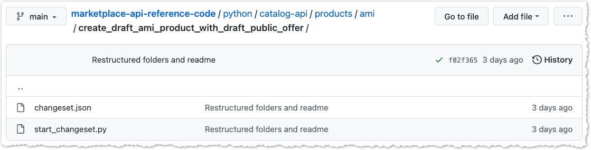

# AWS Marketplace Catalog API Reference Code Library - Python

## How to use the reference code examples

You will need to have [Python 3.x](https://www.python.org/downloads/) installed.


### Change directories into the Python source code folder:
```
cd aws-marketplace-reference-code/python
```

### Create a python virtual environment:
```
python -m venv venv
```

### Activate the environment:
**Mac OS:**
```
source ./venv/bin/activate
```

**Windows:**
```
venv\scripts\activate
```

### Install requirements:
```
pip install .
```

### Executing the reference code
Once you have cloned the reference code repository, installed Python, and configured your virtual environment, you can explore the reference code and customize it based on your requirements.  Click on any of the use cases below to explore the reference code.   Many of the reference code use cases will consist of a json file named **changeset.json** and a small execution function named **start_changeset.py**.  The execution function code is nearly identical for every use case, while the specific Catalog API possibilities and options are represented in the changeset.json file.



It is important to note, in each changeset.json file there are one or more **Details** objects.  These have been left as JSON to improve readability, but are converted to string values by the [stringify_details.py](./src/utils/stringify_details.py) utility module as [required by the Catalog API](https://docs.aws.amazon.com/marketplace-catalog/latest/api-reference/welcome.html#working-with-details).

## Catalog API reference code

| Use case                                                                                                                                                                                                                                                                   |
|----------------------------------------------------------------------------------------------------------------------------------------------------------------------------------------------------------------------------------------------------------------------------|
| [Create an AMI draft product with a draft public offer](./src/catalog_api/products/ami/create_draft_ami_product_with_draft_public_offer)                                                                                                                                   |
| [Create a container draft product with a draft public offer](./src/catalog_api/products/container/create_draft_container_product_with_draft_public_offer)                                                                                                                  |
| [Create a SaaS draft product with a draft public offer](./src/catalog_api/products/saas/create_draft_saas_product_with_draft_public_offer)                                                                                                                                 |
| [Publish my SaaS product and associated public offer (product will be in limited state by default)](./src/catalog_api/products/saas/publish_saas_product_public_offer)                                                                                                     |
| [Create a public or limited AMI product and public offer with hourly annual pricing and standard or custom EULA](./src/catalog_api/products/ami/create_limited_ami_product_and_public_offer_with_hourly_annual_pricing)                                                    |
| [Create a public or limited AMI product and public offer with hourly pricing and standard or custom EULA](./src/catalog_api/products/ami/create_limited_ami_product_and_public_offer_with_hourly_pricing)                                                                  |
| [Create a public or limited AMI product and public offer with hourly monthly pricing and standard or custom EULA](./src/catalog_api/products/ami/create_limited_ami_product_and_public_offer_with_hourly_monthly_pricing)                                                  |
| [Create a public or limited SaaS product and public offer with subscription(usage) pricing and standard or custom EULA](./src/catalog_api/products/saas/create_limited_saas_product_and_public_offer_with_subscription_pricing)                                            |
| [Create a public or limited SaaS product and public offer with contract with PAYG pricing and standard or custom EULA](./src/catalog_api/products/saas/create_limited_saas_product_and_public_offer_with_contract_with_pay_as_you_go_pricing)                              |
| [Create a public or limited SaaS product and public offer with contract pricing and standard or custom EULA](./src/catalog_api/products/saas/create_limited_saas_product_and_public_offer_with_contract_pricing)                                                           |
| [Create public free trial offer with subscription pricing for SaaS product](./src/catalog_api/offers/create_public_free_trial_offer_with_subscription_pricing_for_saas_product)                                                                                            |
| [Change free trial duration of public free trial offer for SaaS product](./src/catalog_api/offers/update_free_trial_duration_of_public_free_trial_offer_for_saas_product)                                                                                                  |
| [Create limited container product with public offer, contract pricing and standard EULA](./src/catalog_api/products/container/create_limited_container_product_public_offer)                                                                                               |
| [Make your AMI or SaaS or Container product restricted](./src/catalog_api/products/ami/restrict_existing_ami)                                                                                                                                                              |
| [Update name and description of my public offer](./src/catalog_api/offers/update_offer_name_and_description)                                                                                                                                                               |
| [Update EULA of my public offer](./src/catalog_api/offers/update_eula)                                                                                                                                                                                                     |
| [Update refund policy of my public offer](./src/catalog_api/offers/update_refund_policy)                                                                                                                                                                                   |
| [Update geo-targeting of my public offer to specifically target few countries (e.g US/Canada/Spain) so that only customers in that region can subscribe to my offer](./src/catalog_api/offers/update_offer_targeting)                                                      |
| [Update price of my public offer for my AMI product with hourly annual pricing](./src/catalog_api/offers/update_offer_with_hourly_annual_pricing)                                                                                                                          |
| [Update price of my public offer for my SaaS product with contract and PAYG pricing](./src/catalog_api/offers/update_offer_with_contract_and_pay_as_you_go_pricing)                                                                                                        |
| [Add a new dimension to an AMI product and set the hourly price for this new dimension in the public offer](./src/catalog_api/products/ami/add_dimension_to_ami_product_and_set_price_in_public_offer)                                                                     |
| [Update (e.g name) dimensions on my AMI or SaaS product](./src/catalog_api/products/saas/update_name_dimension_saas_product)                                                                                                                                               |
| [Add a region where my AMI product is deployed](./src/catalog_api/products/ami/add_region_existing_ami_product)                                                                                                                                                            |
| [Restrict a region where my AMI product is deployed](./src/catalog_api/products/ami/restrict_region_existing_ami_product)                                                                                                                                                  |
| [Specify if I want my AMI assets to be deployed in new regions built by AWS (future region support)](./src/catalog_api/products/ami/update_future_region_support)                                                                                                          |
| [List all my AMI or SaaS or Container products and associated public offers](./src/catalog_api/products/list_products)                                                                                                                                                     |
| [Describe my AMI or SaaS or Container product and check if it contains all the information I need to know about the product](./src/catalog_api/products/describe_product)                                                                                                  |
| [Describe my public offer and check if it contains all the information I need to know about the offer](./src/catalog_api/offers/describe_offer)                                                                                                                            |
| [Create draft private offers for my AMI or SaaS product so I can review them internally before publishing to my buyers](./src/catalog_api/offers/create_draft_private_offer)                                                                                               |
| [Create a private offer with hourly annual pricing for my AMI product and add a custom EULA](./src/catalog_api/offers/create_private_offer_with_hourly_annual_pricing_for_ami_product)                                                                                     |
| [Create a private offer with hourly pricing for my AMI product](./src/catalog_api/offers/create_private_offer_with_hourly_pricing_for_ami_product)                                                                                                                         |
| [Create a private offer with contract pricing for my AMI product](./src/catalog_api/offers/create_private_offer_with_contract_pricing_for_ami_product)                                                                                                                     |
| [Create a private offer (target buyers)for my Container product with contract pricing](./src/catalog_api/offers/create_private_offer_with_contract_pricing_for_container_product)                                                                                          |
| [Create draft resale authorization for any product type (AMI/SaaS/Container) so I can review them internally before publishing to my CPs](./src/catalog_api/resale_authorization/draft_resaleauth_allproducttype)                                                          |
| [Publish a one-time resale authorization on my SaaS product so my CP can use that to create Channel Partner Private Offer (CPPO)](./src/catalog_api/resale_authorization/onetime_resaleauth_privateoffer)                                                                  |
| [Publish one-time resale authorization for any product type (AMI/SaaS/Container) and add a custom EULA to be sent to the buyer](./src/catalog_api/resale_authorization/onetime_resaleauth_custom_eula)                                                                     |
| [Publish one-time resale authorization for any product type (AMI/SaaS/Container) and add reseller contract documentation between the ISV and CP](./src/catalog_api/resale_authorization/onetime_resaleauth_customreseller_contractdoc)                                     |
| [Publish multi-use resale authorization with expiry date for my AMI product with hourly annual pricing so my CP can use that to create CPPO](./src/catalog_api/resale_authorization/multiuse_resaleauth_expirydate_cppo)                                                   |
| [Publish multi-use resale authorization without expiry date for my AMI product with hourly annual pricing so my CP can use that to create CPPO](./src/catalog_api/resale_authorization/multiuse_resaleauth_no_expirydate_cppo)                                             |
| [Publish multi-use resale authorization with expiry date for any product type (AMI/SaaS/Container) and add a custom EULA to be sent to the buyer](./src/catalog_api/resale_authorization/multiuse_resaleauth_expirydate_custom_eula)                                       |
| [Publish multi-use resale authorization with expiry date for any product type (AMI/SaaS/Container) and add reseller contract documentation between the ISV and CP](./src/catalog_api/resale_authorization/multiuse_resaleauth_expirydate_customreseller_contractdoc)       |
| [Publish multi-use resale authorization without expiry date for any product type (AMI/SaaS/Container) and add a custom EULA to be sent to the buyer](./src/catalog_api/resale_authorization/multiuse_resaleauth_no_expirydate_custom_eula)                                 |
| [Publish multi-use resale authorization without expiry date for any product type (AMI/SaaS/Container) and add reseller contract documentation between the ISV and CP](./src/catalog_api/resale_authorization/multiuse_resaleauth_no_expirydate_customreseller_contractdoc) |
| [Create draft CPPO for any product type (AMI/SaaS/Container) so I can review them internally before publishing to my buyers](./src/catalog_api/channel_partner_offers/create_draft_cppo_offer)                                                                             |
| [Publish CPPO using one-time resale authorization on AMI, SaaS, or Container products and update price markup](./src/catalog_api/channel_partner_offers/publish_one_time_cppo_with_price_markup)                                                                           |
| [Publish CPPO using one-time resale authorization on any product type (AMI/SaaS/Container) and append buyer EULA with what was received from ISV](./src/catalog_api/channel_partner_offers/publish_cppo_eula)                                                              |
| [Update the offer expiry date of a CPPO I created to a date in future so my buyers get more time to evaluate and accept the offer](./src/catalog_api/channel_partner_offers/update_cppo_expiry_date)                                                                       |
| [Publish CPPO using multi-use resale authorization with expiry date on AMI products and update price markup](./src/catalog_api/channel_partner_offers/publish_cppo_price_markup)                                                                                           |
| [Publish CPPO using multi-use resale authorization with expiry date on SaaS products and update price markup](./src/catalog_api/channel_partner_offers/publish_cppo_price_markup)                                                                                          |
| [Publish CPPO using multi-use resale authorization with expiry date on Container products and update price markup](./src/catalog_api/channel_partner_offers/publish_cppo_price_markup)                                                                                     |
| [Publish CPPO using multi-use resale authorization with expiry date on any product type (AMI/SaaS/Container) and append buyer EULA with what was received from ISV](./src/catalog_api/offers/channel_partner_offers/publish_cppo_eula)                                     |
| [Publish more than one CPPO using multi-use resale authorization with or without expiry date on any product type (AMI/SaaS/Container) and update price markup](./src/catalog_api/channel_partner_offers/publish_cppo_price_markup)                                         |
| [Publish CPPO using multi-use resale authorization without expiry date on AMI products and update price markup](./src/catalog_api/channel_partner_offers/publish_cppo_price_markup)                                                                                        |
| [Publish CPPO using multi-use resale authorization without expiry date on SaaS products and update price markup](./src/catalog_api/channel_partner_offers/publish_cppo_price_markup)                                                                                       |
| [Publish CPPO using multi-use resale authorization without expiry date on Container products and update price markup](./src/catalog_api/channel_partner_offers/publish_cppo_price_markup)                                                                                  |
| [Publish CPPO using multi-use resale authorization without expiry date on any product type (AMI/SaaS/Container) and append buyer EULA with what was received from ISV](./src/catalog_api/offers/channel_partner_offers/publish_cppo_eula)                                  |
| [Update name/description of one-time or multi-use resale authorization before publishing for any product type (AMI/SaaS/Container)](./src/catalog_api/resale_authorization/update_unpublished_resale_authorization)                                                        |
| [Publish one-time resale authorization for any product type (AMI/SaaS/Container) and add Flexible payment schedule](./src/catalog_api/resale_authorization/publish_onetime_resale_authorization_flexible_payment)                                                          |
| [Publish one-time resale authorization for any product type (AMI/SaaS/Container) and add specific buyer account for the resale](./src/catalog_api/resale_authorization/publish_onetime_resale_authorization_specific_buyer)                                                |
| [Publish multi-use resale authorization with expiry date for any product type (AMI/SaaS/Container) and add specific buyer account for the resale](./src/catalog_api/resale_authorization/publish_multiuse_resale_authorization_expirydate_specific_buyer)                  |
| [Publish multi-use resale authorization without expiry date for any product type (AMI/SaaS/Container) and add specific buyer account for the resale](./src/catalog_api/resale_authorization/publish_multiuse_resale_authorization_no_expirydate_specific_buyer)            |
| [Restrict a one-time resale authorization for any product type (AMI/SaaS/Container)](./src/catalog_api/resale_authorization/restrict_resale_authorization)                                                                                                                 |
| [Publish one-time resale authorization for any product type (AMI/SaaS/Container) and add whether it is renewal or not](./src/catalog_api/resale_authorization/onetime_resaleauth_renewal)                                                                                  |
| [Create a custom dimension for an existing SaaS product and create a private offer](./src/catalog_api/offers/create_saas_product_custom_dimension_and_private_offer)                                                                                                       |
| [Describe a resale authorization](./src/catalog_api/channel_partner_offers/describe_resale_authorization)                                                                                                                                                                  |
| [List all CPPOs created by a channel partner](./src/catalog_api/channel_partner_offers/list_all_cppo_offers)                                                                                                                                                               |
| [List all shared resale authorizations available to a channel partner](./src/catalog_api/channel_partner_offers/list_all_shared_resale_authorizations)                                                                                                                     |
| [Create a replacement private offer from an existing agreement with contract pricing](./src/catalog_api/offers/create_replacement_private_offer_with_contract_pricing)                                                                                                     |
| [Create a resale authorization replacement private offer from an existing agreement with contract pricing](./src/catalog_api/channel_partner_offers/create_resale_authorization_replacement_offer)                                                                         |
| [List and describe all Offers associated with a product](./src/catalog_api/entities/list_product_offers.py)                                                                                                                                                                |
| [BatchDescribe all entities in a single call](./src/catalog_api/entities/batch_describe_entities.py)                                              |
| [Create a Multi Product solution](./src/catalog_api/multi_product_solutions/solutions/create_solution_listing/)                        |
| [list all Multi Product solutions](./src/catalog_api/multi_product_solutions/solutions/list_solutions)                        |
| [Update Multi Product solution information](./src/catalog_api/multi_product_solutions/solutions/update_solution_information/)                        |
| [Update related products for the Multi Product solution](./src/catalog_api/multi_product_solutions/solutions/update_related_products/)                           |
| [Release the multi product solution](./src/catalog_api/multi_product_solutions/solutions/release_solution/)|
| [Create an Offer set for Multi product solution](./src/catalog_api/multi_product_solutions/offers/create_offer_set/)|
| [Update an Offer set information for Multi product solution](./src/catalog_api/multi_product_solutions/offers/update_offerset_information/)|
| [Associate offer to an offer set](./src/catalog_api/multi_product_solutions/offers/associate_offer/)|
| [Disassociate offer to an offer set](./src/catalog_api/multi_product_solutions/offers/disassociate_offer/)|
| [Associate multi product solution to a offer set](./src/catalog_api/multi_product_solutions/offers/associate_solution/)|
| [Disassociate multi product solution to a offer set](./src/catalog_api/multi_product_solutions/offers/disassociate_solution%20/)|
| [Release Offer Set for multi product solution](./src/catalog_api/multi_product_solutions/offers/release_offer_set/)|
| [Offer workflow for multi product solution](./src/catalog_api/multi_product_solutions/offers/offer_workflow/)|


## Agreement API reference code

### Seller use cases

|Use case|
|--------|
|[Obtain a list of all of my agreements](./src/agreements_api/seller/get_all_agreements)|
|[Filter my agreements based on product ID, Customer AWS Account ID, Offer ID](./src/agreements_api/seller/search_agreements_by_id)|
|[Filter my agreements based on product ID](./src/agreements_api/seller/search_agreements_by_product_id)|
|[Filter my agreements based on AWS Account ID](./src/agreements_api/seller/search_agreements_by_account_id)|
|[Filter my agreements based on Offer ID](./src/agreements_api/seller/search_agreements_by_offer_id)|
|[Filter my agreements based on whether its end date is before or after a date I can specify (such as today)](./src/agreements_api/seller/search_agreements_by_endDate)|
|[Filter my agreements based on status](./src/agreements_api/seller/search_agreements_by_status)|
|[Filter my agreement based on its product type](./src/agreements_api/seller/search_agreements_by_id)|
|[Obtain metadata about my agreement, like its sign date, start date or end date](./src/agreements_api/seller/describe_agreement)|
|[Obtain metadata about the customer who created the agreement, such as the customer's AWS Account ID](./src/agreements_api/seller/get_agreement_customer)|
|[Obtain all the Agreement IDs](./src/agreements_api/seller/get_all_agreement_ids)|
|[Obtain information about the product and offer that the agreement was created on such as Product ID and Offer ID](./src/agreements_api/seller/get_agreement_product_offer_detail)|
|[Obtain the Product Type of the product the agreement was created on](./src/agreements_api/seller/get_agreement_product_type)|
|[Retrieve the status of the agreement](./src/agreements_api/seller/get_agreement_status)|
|[Obtain financial details, such as Total Contract Value of the agreement](./src/agreements_api/seller/get_agreement_financial_details)|
|[Obtain the auto-renewal status of the agreement](./src/agreements_api/seller/get_agreement_terms_auto_renewal)|
|[Obtain the pricing type of the agreement (contract, FPS, metered, free etc.)](./src/agreements_api/seller/get_agreement_pricing_type)|
|[Obtain the payment schedule I have agreed to with the agreement, including the invoice date and invoice amount](./src/agreements_api/seller/get_agreement_terms_payment_schedule)|
|[Obtain the EULA I have entered into with my customer via the agreement](./src/agreements_api/seller/get_agreement_terms_eula)|
|[Obtain the support and refund policy I have provided to the customer](./src/agreements_api/seller/get_agreement_support_terms/get_agreement_support_terms.py)|
|[Obtain the details from an agreement of a free trial I have provided to the customer](./src/agreements_api/seller/get_agreement_free_trial_details/get_agreement_free_trial_details.py)|
|[Obtain the dimensions the buyer has purchased from me via the agreement](./src/agreements_api/seller/get_agreement_terms_dimension_purchased)|
|[Obtain pricing per each dimension in the agreement](./src/agreements_api/seller/get_agreement_terms_pricing_each_dimension)|
|[Obtain instances of each dimension that buyer has purchased in the agreement](./src/agreements_api/seller/get_agreement_terms_dimension_instances)|

### Buyer use cases

|Use case|
|--------|
|[Amend an AMI agreement with ConfigurableUpfrontPricingTerm by updating dimension quantity for usage pricing model](./src/agreements_api/buyer/amend_ami_cupt_for_usage_pricing.py)|
|[Amend a SaaS contract agreement to add or update its renewal term](./src/agreements_api/buyer/amend_saas_contract_renewal_term.py)|
|[Create a new AMI free trial agreement](./src/agreements_api/buyer/new_ami_free_trial.py)|
|[Create a new SaaS contract agreement with upfront payment](./src/agreements_api/buyer/new_saas_contract_with_upfront_payment.py)|
|[Replace an AMI usage-based pricing term but keep the existing ConfigurableUpfrontPricingTerm](./src/agreements_api/buyer/replace_ami_usage_based_pricing_term_but_not_cupt.py)|
|[Replace a SaaS contract agreement with a new agreement-based offer](./src/agreements_api/buyer/replace_saas_contract_with_agreement_based_offer.py)|
|[Replace a SaaS free trial with a Contract with Consumption Pricing (CCP)](./src/agreements_api/buyer/replace_saas_free_trial_with_ccp.py)|
|[Replace a SaaS usage-based pricing term and cancel the previous agreement](./src/agreements_api/buyer/replace_saas_usage_based_pricing_term_and_cancel.py)|
|[Update purchase orders after the agreement has been accepted](./src/agreements_api/buyer/update_purchase_orders_after_agreement_acceptance.py)|
|[Accept an agreement cancellation request initiated by the seller](./src/agreements_api/buyer/agreementCancellation/accept_agreement_cancellation_request.py)|
|[Get details of a specific agreement cancellation request](./src/agreements_api/buyer/agreementCancellation/get_agreement_cancellation_request.py)|
|[List all agreement cancellation requests for agreements I participate in as acceptor](./src/agreements_api/buyer/agreementCancellation/list_agreement_cancellation_requests.py)|
|[Reject an agreement cancellation request initiated by the seller](./src/agreements_api/buyer/agreementCancellation/reject_agreement_cancellation_request.py)|
|[Accept an agreement payment request initiated by the seller](./src/agreements_api/buyer/paymentRequest/accept_agreement_payment_request.py)|
|[Get details of a specific agreement payment request](./src/agreements_api/buyer/paymentRequest/get_agreement_payment_request.py)|
|[List all agreement payment requests for agreements I participate in as acceptor](./src/agreements_api/buyer/paymentRequest/list_agreement_payment_requests.py)|
|[Reject an agreement payment request initiated by the seller](./src/agreements_api/buyer/paymentRequest/reject_agreement_payment_request.py)|

### Submit defects & questions
If you find any defects with the APIs, need help troubleshooting, or have general questions or feedback, [use this form to contact us](https://aws.amazon.com/marketplace/management/contact-us/)


## AWS SDK for Python (Boto3)

Get started quickly using AWS with boto3, the AWS SDK for Python. Boto3 makes it easy to integrate your Python application, library, or script with AWS services including Amazon S3, Amazon EC2, Amazon DynamoDB, and more.

https://aws.amazon.com/sdk-for-src/

